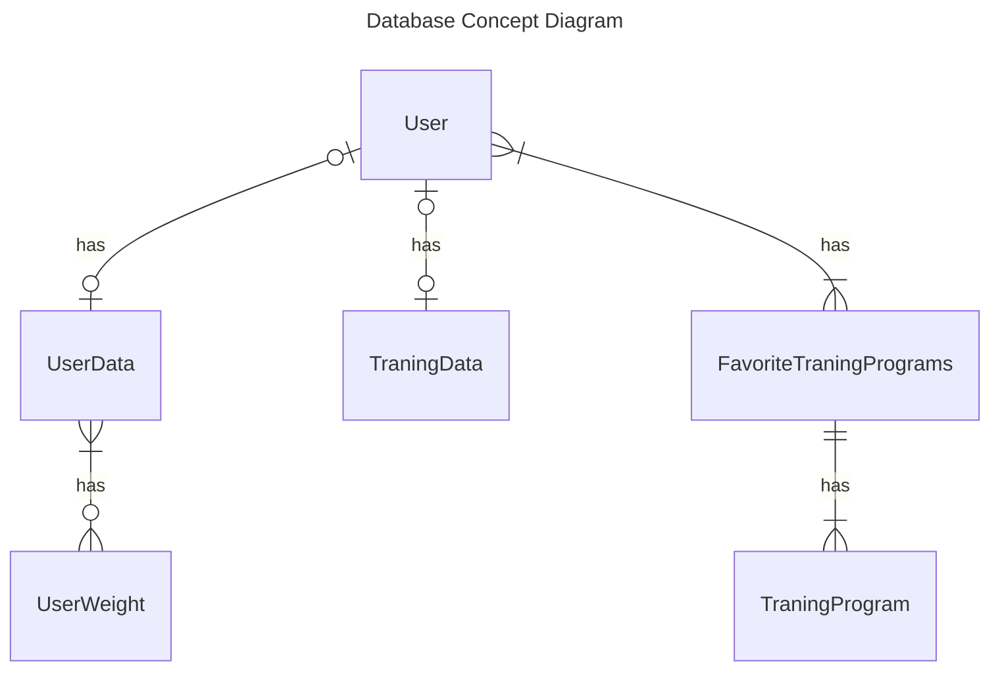
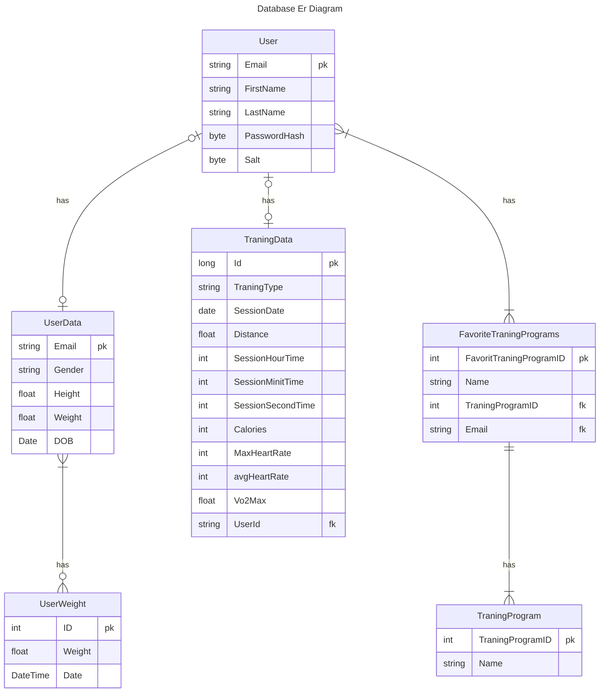

```mermaid
---
title: Database Concept Diagram 
---
erDiagram
    User{}
    
    User |o--o| UserData : has
    User |o--o| TraningData : has
    User }|--|{ FavoriteTraningPrograms : has

    UserData {}

    UserWeight {}

    UserData }|--o{ UserWeight : has
    
    TraningData {}

    TraningProgram {}

    FavoriteTraningPrograms ||--|{ TraningProgram : has

    FavoriteTraningPrograms {}

```

```mermaid
---
title: Database Er Diagram
---
erDiagram
    User{
        string Email pk
        string FirstName
        string LastName
        byte PasswordHash
        byte Salt
    }
    
    User |o--o| UserData : has
    User |o--o| TraningData : has
    User }|--|{ FavoriteTraningPrograms : has

    UserData {
        string Email pk
        string Gender
        float Height
        float Weight
        Date DOB
    }

    UserWeight {
        int ID pk
        float Weight
        DateTime Date
    }

    UserData }|--o{ UserWeight : has
    
    TraningData {
        long Id pk
        string TraningType
        date SessionDate
        float Distance
        int SessionHourTime
        int SessionMinitTime
        int SessionSecondTime
        int Calories
        int MaxHeartRate
        int avgHeartRate
        float Vo2Max
        string UserId fk
    }

    TraningProgram {
        int TraningProgramID pk
        string Name
    }

    FavoriteTraningPrograms ||--|{ TraningProgram : has

    FavoriteTraningPrograms {
        int FavoritTraningProgramID pk
        string Name
        int TraningProgramID fk
        string Email fk
    }
```