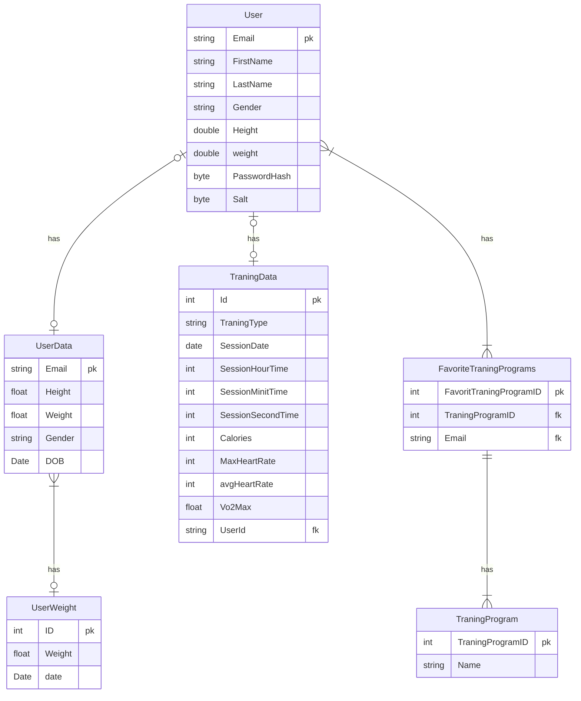

```mermaid
erDiagram
    User{
        string Email pk
        string FirstName
        string LastName
        string Gender
        double Height
        double weight
        byte PasswordHash
        byte Salt
    }
    
    User |o--o| UserData : has
    User |o--o| TraningData : has
    User }|--|{ FavoriteTraningPrograms : has

    UserData {
        string Email pk
        float Height
        float Weight
        string Gender
        Date DOB
    }

    UserData }|--o| UserWeight : has

    UserWeight{
        int ID pk
        float Weight
        Date date
    }
    
    TraningData {
        int Id pk
        string TraningType
        date SessionDate
        int SessionHourTime
        int SessionMinitTime
        int SessionSecondTime
        int Calories
        int MaxHeartRate
        int avgHeartRate
        float Vo2Max
        string UserId fk
    }

    TraningProgram {
        int TraningProgramID pk
        string Name
    }

    FavoriteTraningPrograms ||--|{ TraningProgram : has

    FavoriteTraningPrograms {
        int FavoritTraningProgramID pk
        int TraningProgramID fk
        string Email fk

    }


```