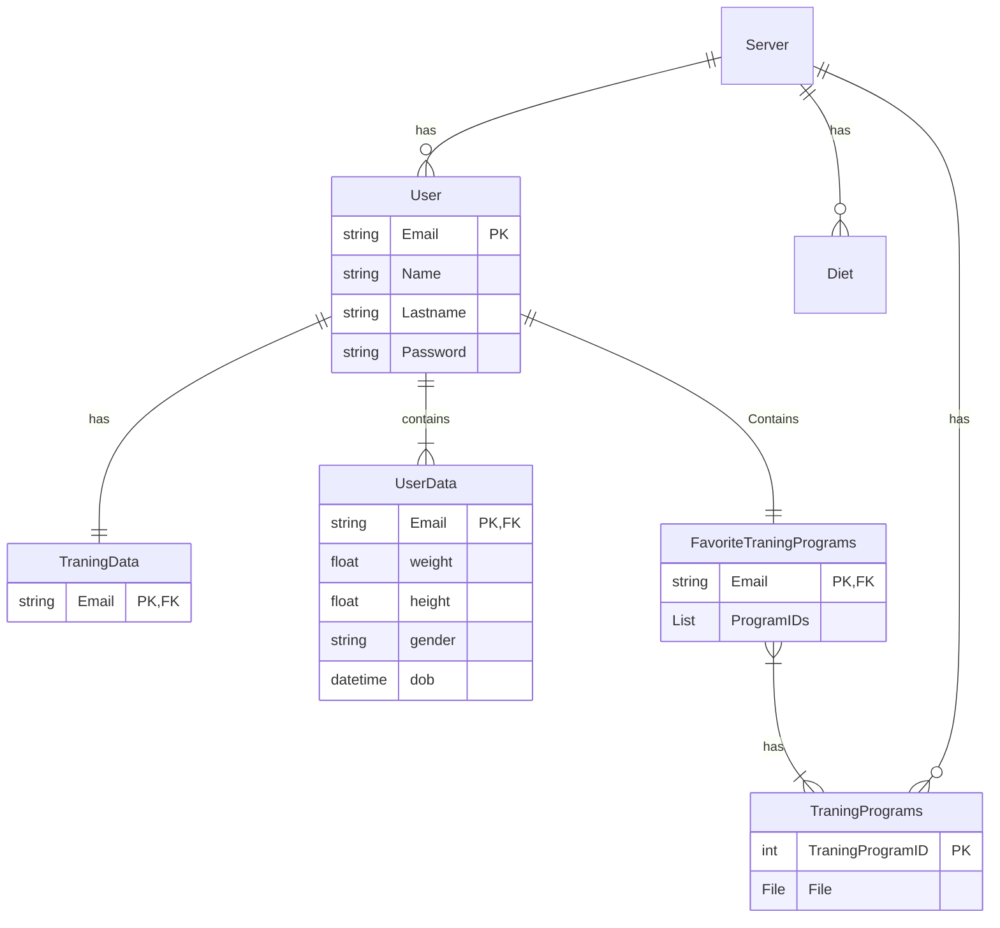

```mermaid
erDiagram

User {
    string Email PK
    string Name
    string Lastname
    string Password
}

TraningData {
    string Email PK, FK
}

UserData {
    string Email PK, FK
    float weight
    float height
    string gender
    datetime dob
}

FavoriteTraningPrograms {
    string Email PK, FK
    List ProgramIDs
}

Server {


}

TraningPrograms {
    int TraningProgramID PK
    File File

}

Diet {

}

User ||--|| TraningData : has
User ||--|{ UserData : contains
User ||--|| FavoriteTraningPrograms : Contains
FavoriteTraningPrograms }|--|{ TraningPrograms : has
Server ||--o{ TraningPrograms : has
Server ||--o{ User : has
Server ||--o{ Diet : has

```