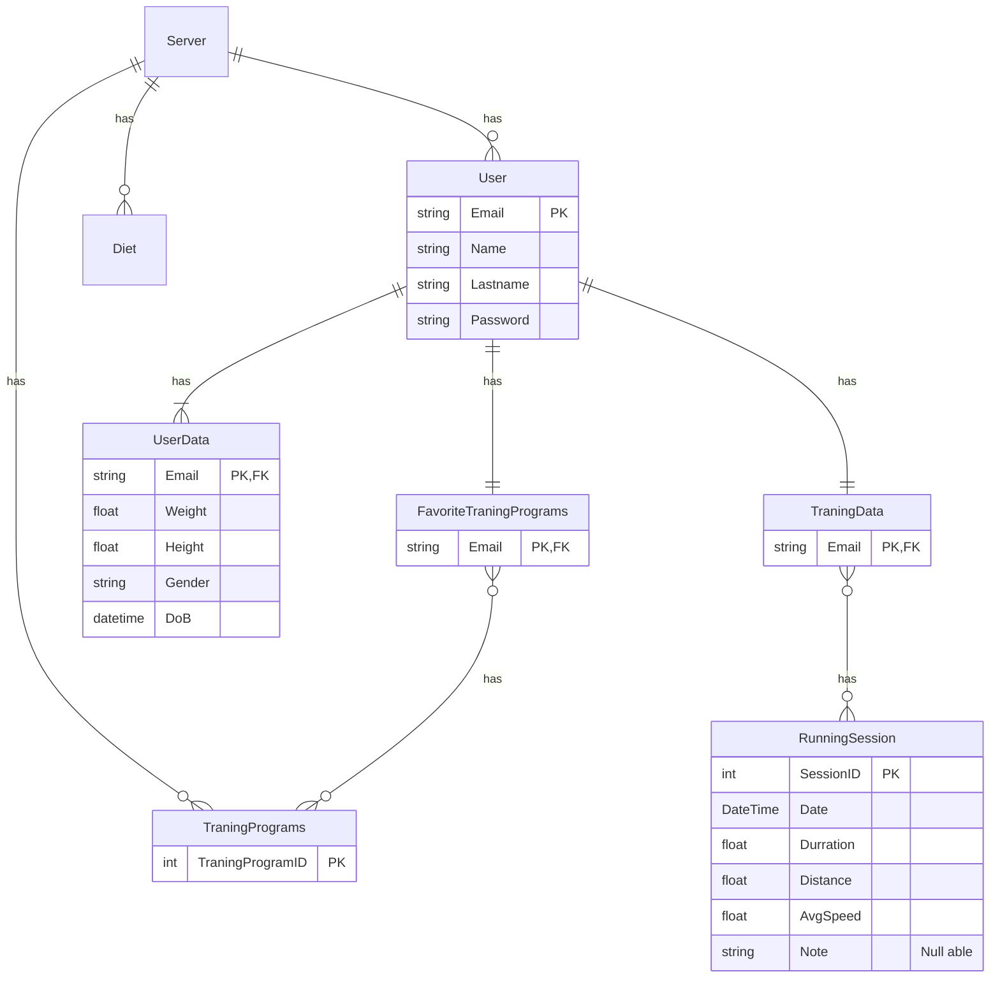

```mermaid
erDiagram

User {
    string Email PK
    string Name
    string Lastname
    string Password
}

TraningData {
    string Email PK, FK
}

UserData {
    string Email PK, FK
    float Weight
    float Height
    string Gender
    datetime DoB
}

FavoriteTraningPrograms {
    string Email PK, FK
}

Server {


}

TraningPrograms {
    int TraningProgramID PK
}

Diet {

}

RunningSession{
    int SessionID PK
    DateTime Date
    float Durration
    float Distance
    float AvgSpeed
    string Note "Null able"
}

User ||--|| TraningData : has
User ||--|{ UserData : has
User ||--|| FavoriteTraningPrograms : has
FavoriteTraningPrograms }o--o{ TraningPrograms : has
Server ||--o{ TraningPrograms : has
Server ||--o{ User : has
Server ||--o{ Diet : has

TraningData }o--o{ RunningSession : has

```