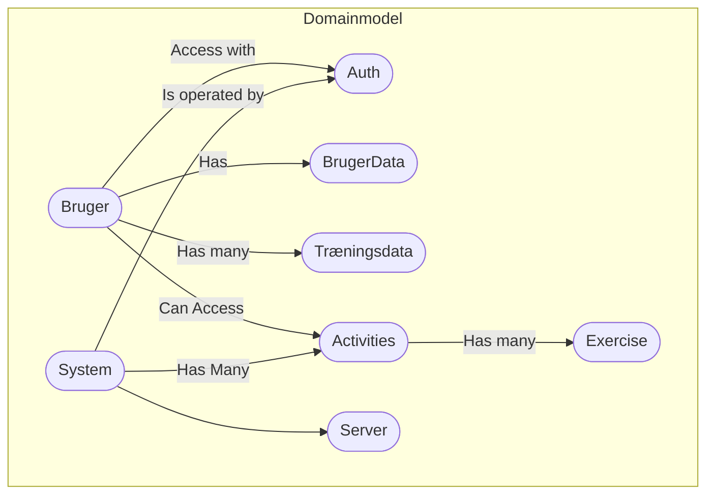

```mermaid
graph TD
    subgraph Domainmodel
        Bruger([Bruger])
        Auth([Auth])
        System([System])
        Server([Server])
        Exercise([Exercise])
        BrugerData([BrugerData])
        Træningsdata([Træningsdata])
        Activities([Activities])
    end

    Bruger -- "Access with"--> Auth
    Bruger -- "Has" --> BrugerData
    Bruger -- "Has many" --> Træningsdata
    Bruger -- "Can Access" --> Activities
    System -- "Has Many" --> Activities
    System --> Server
    Activities -- "Has many" --> Exercise
    System -- "Is operated by" --> Auth
    
```
        