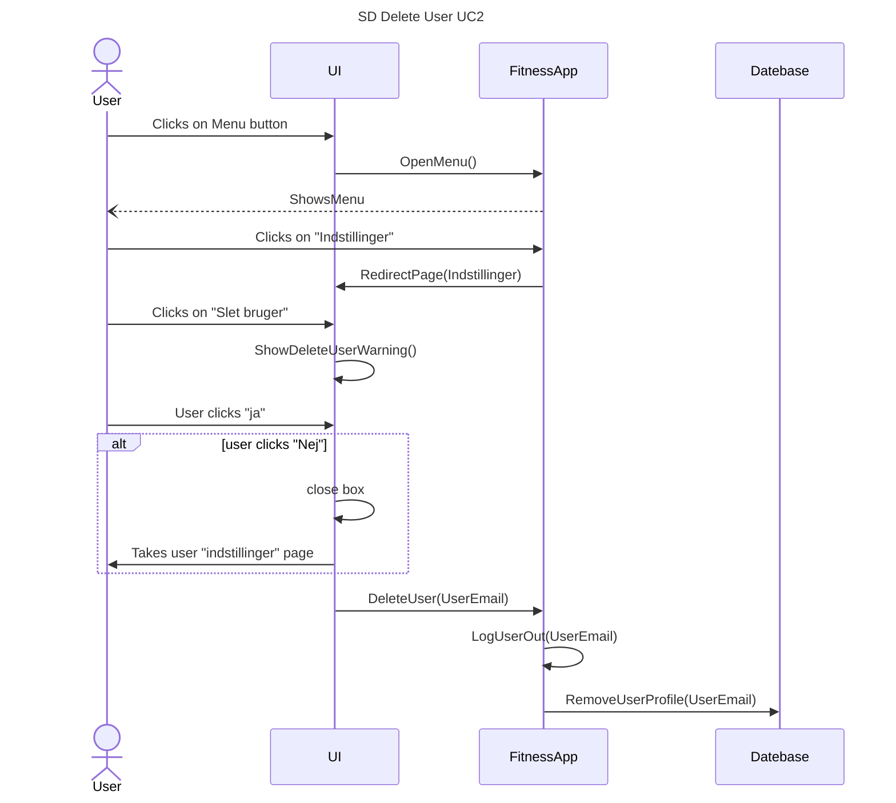

```mermaid
---
title: SD Delete User UC2
---
sequenceDiagram

    Actor User

    User ->> UI: Clicks on Menu button
    UI ->> FitnessApp: OpenMenu()
    FitnessApp --) User: ShowsMenu
    User ->> FitnessApp: Clicks on "Indstillinger"
    FitnessApp ->> UI: RedirectPage(Indstillinger)
    User ->> UI: Clicks on "Slet bruger"
    UI ->> UI: ShowDeleteUserWarning()
    User ->> UI: User clicks "ja"

    alt user clicks "Nej"
        UI ->> UI: close box
        UI ->> User: Takes user "indstillinger" page
    end

    UI ->> FitnessApp: DeleteUser(UserEmail)
    FitnessApp ->> FitnessApp: LogUserOut(UserEmail)
    FitnessApp ->> Datebase: RemoveUserProfile(UserEmail)
```