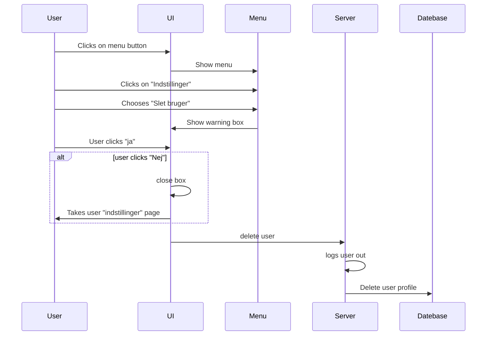

```mermaid
sequenceDiagram
    User ->> UI: Clicks on menu button
    UI ->> Menu: Show menu
    User ->> Menu: Clicks on "Indstillinger"
    User ->> Menu: Chooses "Slet bruger"
    Menu ->> UI: Show warning box
    User ->> UI: User clicks "ja"
    alt user clicks "Nej"
        UI ->> UI: close box
        UI ->> User: Takes user "indstillinger" page
    end
    UI ->> Server: delete user
    Server ->> Server: logs user out
    Server ->> Datebase: Delete user profile
```